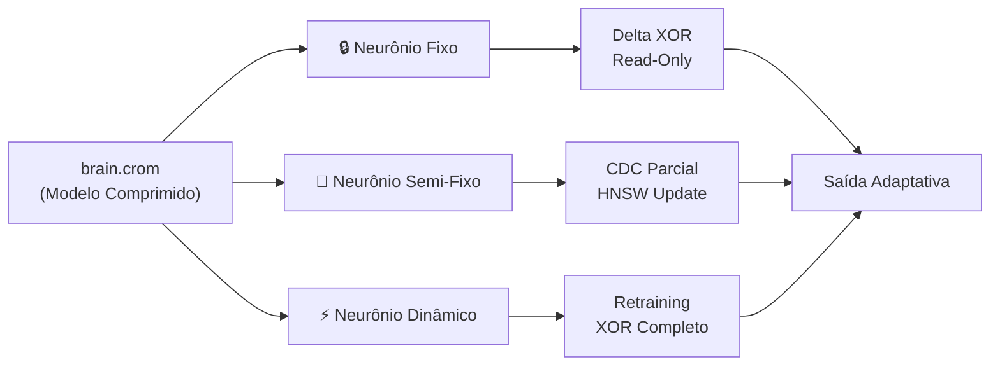

# 🔀 Três Vertentes de Pesquisa

> *"Não escolhemos uma. Exploramos todas. Dados decidem."*

---

## Visão Geral



---

## Vertente 1: Neurônio Fixo (Frozen)

### Conceito
O modelo comprimido em `.crom` é **totalmente imutável**. Nenhum peso é alterado. A adaptação acontece exclusivamente via **tensores delta aplicados em tempo de inferência**.

### Mecânica
```
brain.crom (frozen, read-only)
    │
    ├── Codebook Base (DNA A/T/C/G) → FIXO
    ├── Merkle Tree → verifica integridade
    └── FUSE Mount → leitura O(1) do SSD
    
tensor_delta.bin (externo, variável)
    │
    ├── XOR sobre índices do Codebook
    ├── Poucas centenas de KB
    └── Pode vir de qualquer fonte (P2P, local, gerado)
    
Inferência:
    output = forward_pass(brain.crom XOR tensor_delta)
```

### Vantagens
- ✅ **Zero training em runtime** — apenas aplicação de XOR
- ✅ **Compressão extrema** — DNA Base-4 mantém ratio 4-5x
- ✅ **Determinismo garantido** — Merkle Tree verifica cada bit
- ✅ **Portabilidade total** — delta de KB é compartilhável via P2P
- ✅ **Reversibilidade** — remova o delta e volte ao cérebro original

### Riscos e Edge Cases
- ⚠️ **Delta > 30% do codebook** → pode degradar qualidade (high-entropy bypass)
- ⚠️ **Expressividade limitada** se o codebook base não for representativo
- ⚠️ **Catastrophic forgetting** se deltas acumulados divergirem do espaço original

### Papers de Referência
- **MoFE (2025):** FFN frozen + routing = nosso Neurônio Fixo + Multi-Brain
- **aLoRA (IBM, Apr 2025):** Activated adapters sobre KV cache frozen
- **ZipLLM BitX (2025):** Delta XOR entre modelos = nosso Delta sobre Codebook

### Métricas de Teste
| Métrica | Alvo |
|:---|:---|
| Tamanho do delta vs. cérebro | < 5% |
| Qualidade (BLEU vs. baseline) | > 0.90 |
| Latência de aplicação do delta | < 10ms |
| RAM total (cérebro + delta) | < 1 GB |

---

## Vertente 2: Neurônio Semi-Fixo

### Conceito
O modelo é **parcialmente atualizável**. Os chunks CDC do `.crom` podem ser individualmente substituídos usando busca HNSW (similaridade de cosseno) para identificar **quais sinapses atualizar** sem reconstruir o modelo inteiro.

### Mecânica
```
brain.crom (parcialmente mutável)
    │
    ├── Chunk [0x00..0xFF] → FIXO (base)
    ├── Chunk [0x100..0x1FF] → ATUALIZADO (novo delta)
    ├── Chunk [0x200..0x2FF] → FIXO (base)
    └── ...
    
Processo de Atualização:
    1. Recebe novo dado/contexto
    2. HNSW busca os chunks mais similares ao novo contexto
    3. Apenas esses chunks recebem delta XOR
    4. Merkle Tree parcial recalculada
    5. Chunks não-tocados permanecem intactos
```

### Vantagens
- ✅ **Adaptação contínua** sem rebuildar o .crom inteiro
- ✅ **Granularidade CDC** — chunks de 128-2048 bytes
- ✅ **Soberania** — apenas deltas parciais são enviados P2P
- ✅ **Eficiência** — HNSW garante que só chunks relevantes mudam

### Riscos e Edge Cases
- ⚠️ **Integridade parcial** — Merkle Tree precisa ser parcialmente recalculada
- ⚠️ **Drift entrópico** — entropia pode subir se muitos chunks forem atualizados
- ⚠️ **Consistência** — chunks atualizados devem ser compatíveis com os fixos
- ⚠️ **Sincronização P2P** — precisa de protocolo de versão por chunk

### Papers de Referência
- **TurboQuant (ICLR 2026):** Compressão data-oblivious do KV cache
- **D²-MoE (ICML 2025):** Decomposição de experts em base + delta via SVD
- **Dynamic LoRA (Jan 2025):** Alocação adaptativa de parâmetros por camada

### Métricas de Teste
| Métrica | Alvo |
|:---|:---|
| % de chunks atualizados vs. total | < 15% |
| Tempo de busca HNSW | < 5ms |
| Degradação de entropia | < 10% |
| Merkle Tree parcial overhead | < 2ms |

---

## Vertente 3: Neurônio Dinâmico

### Conceito
O modelo completo é **atualizável via treinamento XOR Delta completo**. Máxima flexibilidade, mas perde alguns benefícios de edge puro.

### Mecânica
```
brain.crom (mutável)
    │
    ├── Treinamento XOR Delta completo (Sinapse Frente 3)
    ├── Codebook inteiro pode ser reconstruído
    ├── Multi-Brain: múltiplos .crom podem ser combinados
    └── P2P: delta completo pode ser distribuído
    
Ciclo:
    1. Carrega brain.crom via FUSE
    2. Recebe dados novos
    3. Treina XOR Delta sobre todo o codebook
    4. Gera brain-v2.crom
    5. Merkle Tree completa recalculada
```

### Vantagens
- ✅ **Flexibilidade máxima** — model inteiro é adaptável
- ✅ **Multi-Brain** — combina múltiplos neurônios treinados
- ✅ **Criatividade emergente** — roteamento entre versões

### Riscos e Edge Cases
- ⚠️ **Custo computacional** — treinar requer mais CPU/RAM
- ⚠️ **Perde edge puro** — não é mais zero-training
- ⚠️ **Versionamento** — precisa de log de deltas completo
- ⚠️ **Colapso** ao combinar neurônios incompatíveis

### Papers de Referência
- **Brainstacks (2026):** Stacks de adapters frozen com routing sigmoid
- **LoRA-Dash (ICLR 2025):** Task-specific directions para fine-tuning
- **KRAdapter (Oct 2025):** Khatri-Rao product para rank efetivo maior

### Métricas de Teste
| Métrica | Alvo |
|:---|:---|
| Tempo de treinamento delta | < 60s (CPU) |
| Compression ratio mantido | > 3x |
| Multi-brain routing latency | < 20ms |
| Qualidade (BLEU) | > 0.95 |

---

## Tabela Comparativa Final

| Aspecto | 🔒 Fixo | 🔄 Semi-Fixo | ⚡ Dinâmico |
|:---|:---|:---|:---|
| Cérebro mutável? | Não | Parcialmente | Sim |
| RAM necessária | < 1 GB | < 2 GB | < 4 GB |
| Latência de adaptação | < 10ms | < 50ms | < 60s |
| Complexidade | Baixa | Média | Alta |
| Criatividade | Via delta | Via HNSW | Via treinamento |
| Soberania | Máxima | Alta | Média |
| Edge viável? | ✅ Sim | ✅ Sim | ⚠️ Parcial |
| Multi-brain? | Routing | Routing + merge | Combinação total |
| Risco principal | Expressividade | Drift entrópico | Custo computacional |

---

## Ordem de Exploração

1. **Fase 1 (Semanas 1-4):** Neurônio Fixo — validar viabilidade mínima
2. **Fase 2 (Semanas 5-8):** Semi-Fixo — testar adaptação parcial
3. **Fase 3 (Semanas 9-12):** Dinâmico — explorar flexibilidade total
4. **Fase 4 (Semanas 13-16):** Comparação cruzada com dados reais

> Todos os testes geram dados em `pesquisas/dados/` e relatórios em `pesquisas/relatorios/`.

---

> **Próximo:** [03 — Arquitetura](03-ARQUITETURA.md)
