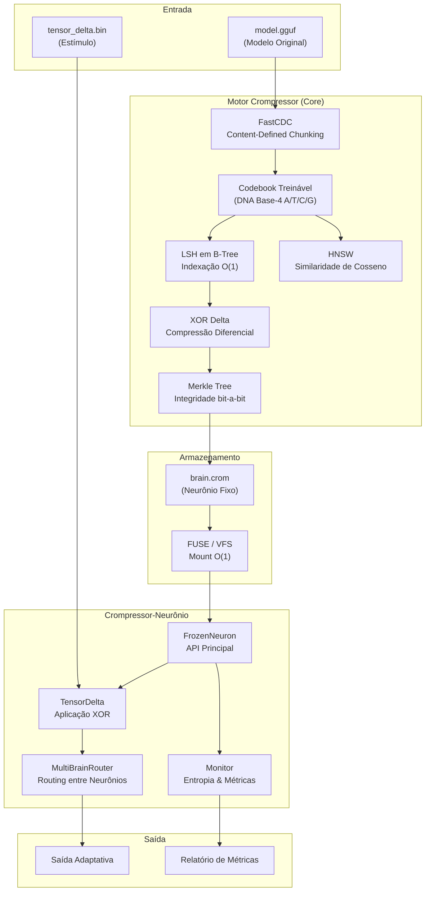

# 🏗️ Arquitetura Técnica

> *"Do modelo bruto ao neurônio operacional em 4 passos."*

---

## Diagrama de Alto Nível



---

## Fluxo Detalhado: Train → Freeze → Infer → Route

### Passo 1: Train-Brain
```
crompressor train --dna --domain=brain --input=model-7B.gguf

┌─────────────────────────────────────────────────┐
│  1.1  FastCDC divide modelo em chunks           │
│       (rolling hash, avg 512 bytes)             │
│                                                 │
│  1.2  Codebook treina sobre os chunks           │
│       (LSH indexa em B-Tree)                    │
│                                                 │
│  1.3  HNSW determina similaridade entre chunks  │
│       (cosseno, dim=128)                        │
│                                                 │
│  1.4  Chunks duplicados → referência XOR Delta  │
│       (grava apenas a diferença)                │
│                                                 │
│  1.5  DNA Encoder converte para Base-4          │
│       (A=00, T=01, C=10, G=11)                 │
│                                                 │
│  1.6  Merkle Tree calculada sobre todos chunks  │
│       (integridade verificável)                 │
│                                                 │
│  OUTPUT: brain.crom                             │
│  - Header: versão, flags, domínio               │
│  - Codebook: índice DNA                         │
│  - Chunks: dados comprimidos                    │
│  - Merkle: hash tree                            │
│  - Metadata: modelo original, dimensões         │
└─────────────────────────────────────────────────┘
```

### Passo 2: Freeze
```
crompressor freeze brain.crom

┌─────────────────────────────────────────────────┐
│  2.1  Marca flag FROZEN no header               │
│                                                 │
│  2.2  Calcula hash final (SHA-256)              │
│                                                 │
│  2.3  Opcional: assina com Dilithium            │
│       (pós-quântica, via crompressor-security)  │
│                                                 │
│  2.4  Gera certificado de integridade           │
│       brain.crom.sig                            │
│                                                 │
│  FLAG: READ_ONLY | FROZEN | SIGNED              │
└─────────────────────────────────────────────────┘
```

### Passo 3: Infer-with-Delta
```
neuronio infer --brain=brain.crom --delta=tensor_delta.bin

┌─────────────────────────────────────────────────┐
│  3.1  FUSE monta brain.crom como filesystem     │
│       (leitura aleatória O(1) do SSD)           │
│                                                 │
│  3.2  Carrega tensor_delta.bin em memória        │
│       (pequeno, geralmente < 1 MB)              │
│                                                 │
│  3.3  Para cada chunk requisitado:               │
│       chunk_original = FUSE.read(offset)         │
│       chunk_modificado = chunk_original XOR delta │
│       activation = forward_pass(chunk_modificado)│
│                                                 │
│  3.4  Cache de ativações por hash CDC            │
│       (idêntico ao Sinapse Fase 2)              │
│                                                 │
│  3.5  Monitor registra entropia de Shannon      │
│       (delta vs. original vs. output)           │
│                                                 │
│  OUTPUT: resposta adaptativa + métricas          │
└─────────────────────────────────────────────────┘
```

### Passo 4: Route-or-Update
```
neuronio route --brains=brain1.crom,brain2.crom,brain3.crom

┌─────────────────────────────────────────────────┐
│  OPÇÃO A: Multi-Brain Routing                    │
│  4A.1  Carrega N neurônios fixos via FUSE       │
│  4A.2  Para cada prompt, HNSW determina qual    │
│         neurônio é mais similar ao contexto     │
│  4A.3  Routing dinâmico (top-K seleção)         │
│  4A.4  Composição ponderada das saídas          │
│  → Criatividade emergente via diversidade       │
│                                                 │
│  OPÇÃO B: Delta Permanente (Semi-Fixo)          │
│  4B.1  Aplica delta seletivamente (HNSW)        │
│  4B.2  Regrava apenas chunks afetados           │
│  4B.3  Recalcula Merkle Tree parcial            │
│  4B.4  Gera brain-v2.crom                       │
│  → Adaptação permanente mantendo integridade    │
└─────────────────────────────────────────────────┘
```

---

## Estrutura de Código Proposta (Futuro)

```
crompressor-neuronio/
├── cmd/
│   ├── neuronio-train/          # CLI: cria cérebro fixo a partir de modelo
│   │   └── main.go
│   ├── neuronio-infer/          # CLI: inferência com tensores delta
│   │   └── main.go
│   └── neuronio-route/          # CLI: multi-brain routing
│       └── main.go
├── pkg/
│   ├── neuron/                  # API pública
│   │   ├── frozen.go            # FrozenNeuron (Vertente 1)
│   │   ├── semifixed.go         # SemiFixedNeuron (Vertente 2)
│   │   ├── dynamic.go           # DynamicNeuron (Vertente 3)
│   │   └── neuron.go            # Interface base
│   └── tensor/                  # Operações tensoriais
│       ├── delta.go             # XOR Delta
│       ├── vq.go                # Vector Quantization
│       └── compose.go           # Composição multi-tensor
├── internal/
│   ├── brain/                   # Congelamento + Merkle parcial
│   │   ├── freeze.go
│   │   └── verify.go
│   ├── delta/                   # Aplicação de tensores
│   │   ├── xor.go
│   │   └── apply.go
│   ├── routing/                 # Multi-Brain Engine
│   │   ├── router.go
│   │   └── hnsw.go
│   └── monitor/                 # Métricas em tempo real
│       ├── entropy.go
│       └── metrics.go
└── go.mod
```

---

## Formato do Arquivo brain.crom (Proposto)

```
┌────────────────────────────────────────┐
│ HEADER (64 bytes)                      │
│ ┌──────────────────────────────────┐   │
│ │ Magic: "CROM" (4 bytes)          │   │
│ │ Version: 0x01 (1 byte)           │   │
│ │ Flags: FROZEN|SIGNED (1 byte)    │   │
│ │ Domain: "brain" (8 bytes)        │   │
│ │ ChunkCount: uint32 (4 bytes)     │   │
│ │ CodebookSize: uint32 (4 bytes)   │   │
│ │ OriginalSize: uint64 (8 bytes)   │   │
│ │ CompressedSize: uint64 (8 bytes) │   │
│ │ MerkleRoot: [32]byte (32 bytes)  │   │
│ └──────────────────────────────────┘   │
│                                        │
│ CODEBOOK (variável)                    │
│ ┌──────────────────────────────────┐   │
│ │ Entry[0]: hash → DNA sequence    │   │
│ │ Entry[1]: hash → DNA sequence    │   │
│ │ ...                              │   │
│ │ Entry[N]: hash → DNA sequence    │   │
│ └──────────────────────────────────┘   │
│                                        │
│ CHUNKS (variável)                      │
│ ┌──────────────────────────────────┐   │
│ │ Chunk[0]: tipo + dados/ref       │   │
│ │ Chunk[1]: tipo + dados/ref       │   │
│ │ ...                              │   │
│ └──────────────────────────────────┘   │
│                                        │
│ MERKLE TREE (variável)                 │
│ ┌──────────────────────────────────┐   │
│ │ Leaf hashes + internal nodes     │   │
│ └──────────────────────────────────┘   │
│                                        │
│ METADATA (variável, JSON)              │
│ ┌──────────────────────────────────┐   │
│ │ { "source": "model.gguf",        │   │
│ │   "params": 7000000000,          │   │
│ │   "dimensions": [4096, 32, 128], │   │
│ │   "created": "2026-04-11T..." }  │   │
│ └──────────────────────────────────┘   │
└────────────────────────────────────────┘
```

---

> **Próximo:** [04 — Tensor Delta](04-TENSOR-DELTA.md)
