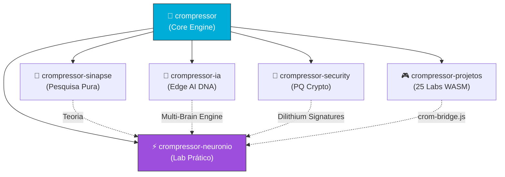

# 🔗 Integração com o Ecossistema

> *"Nenhum código é independente. É um único ecossistema coeso."*

---

## Mapa de Dependências



---

## O Que Vem de Cada Repositório

### 1. crompressor (Core) → **Tudo**
O motor completo é usado como submódulo ou dependência Go:

| Componente | Uso no Neurônio |
|:---|:---|
| `internal/chunker/` (FastCDC) | Divide modelo em chunks para .crom |
| `internal/codebook/` (LSH + HNSW) | Treina codebook DNA sobre o modelo |
| `internal/entropy/` (Shannon) | Mede entropia do cérebro e dos deltas |
| `internal/vfs/` (FUSE) | Monta .crom como filesystem O(1) |
| `internal/merkle/` | Integridade bit-a-bit de cada chunk |
| `internal/crypto/` | ChaCha20 + Dilithium para assinatura |
| `pkg/` (API pública) | Interface Go completa |

```go
// go.mod (proposto)
module github.com/MrJc01/crompressor-neuronio

require (
    github.com/MrJc01/crompressor v1.0.0
)
```

### 2. crompressor-sinapse → **Teoria & Algoritmos**
O sinapse fornece a base teórica e os algoritmos das 5 frentes:

| Frente Sinapse | Uso no Neurônio |
|:---|:---|
| Frente 1: Tokenização CDC | Base da divisão do modelo em chunks |
| Frente 2: Forward Pass Diferencial | Cache de ativações no neurônio fixo |
| Frente 3: Treinamento XOR Delta | Mecanismo de delta sobre codebook |
| Frente 4: Vector Quantization Neural | VQ no espaço do codebook |
| Frente 5: Descoberta de Rotas | Multi-Brain routing distribuído |

### 3. crompressor-ia → **Multi-Brain Engine**
O crompressor-ia V4.x já implementa Multi-Brain:

| Componente IA | Uso no Neurônio |
|:---|:---|
| DNA Base-4 Encoder | Codificação dos pesos do modelo |
| Multi-Brain Engine V4.2 | Routing entre neurônios fixos |
| FUSE pipeline | Leitura fractal do SSD |
| `crom_monitor.sh` | Monitor de entropia em tempo real |

### 4. crompressor-security → **Assinatura & Soberania**

| Componente Security | Uso no Neurônio |
|:---|:---|
| ChaCha20-Poly1305 | Criptografia dos deltas em-flight |
| Dilithium (PQ) | Assinatura dos neurônios e deltas |
| Silent Drop | Proteção P2P para troca de deltas |
| HMAC O(1) | Verificação rápida de integridade |

### 5. crompressor-projetos → **Visualização WASM**

| Componente Projetos | Uso no Neurônio |
|:---|:---|
| `crom-bridge.js` | Middleware WASM para labs no browser |
| Lab 25 (Cognitive Trainer) | Reutilizável para treinar neurônios |
| Lab 22 (File Forensics) | Análise de entropia do .crom |
| Hub (`/hub/index.html`) | Integração visual com novos labs |

---

## Fluxo de Integração

```
                crompressor (Core)
                       │
           ┌───────────┴───────────┐
           │                       │
    go.mod dependency        git submodule
           │                       │
           ▼                       ▼
    neuronio/pkg/           neuronio/pesquisas/
    (usa API Go)            (scripts usam CLI)
           │
           ├── crompressor-sinapse (teoria)
           │   └── 5 frentes → algoritmos
           │
           ├── crompressor-ia (prática)
           │   └── Multi-Brain → routing
           │
           ├── crompressor-security (crypto)
           │   └── Dilithium → assinatura
           │
           └── crompressor-projetos (visual)
               └── WASM bridge → labs
```

---

## Scripts de Integração

```bash
# Inicializar com submódulo core
git submodule add https://github.com/MrJc01/crompressor.git vendor/crompressor

# Usar CLI do core para treinar cérebro
vendor/crompressor/cmd/crompressor train --dna --domain=brain --input=model.gguf

# Usar monitor do IA para acompanhar
vendor/crompressor-ia/scripts/crom_monitor.sh brain.crom

# Assinar com security
vendor/crompressor-security/scripts/sign.sh brain.crom --algo=dilithium
```

---

> **Próximo:** [06 — Casos de Uso](06-CASOS-DE-USO.md)
