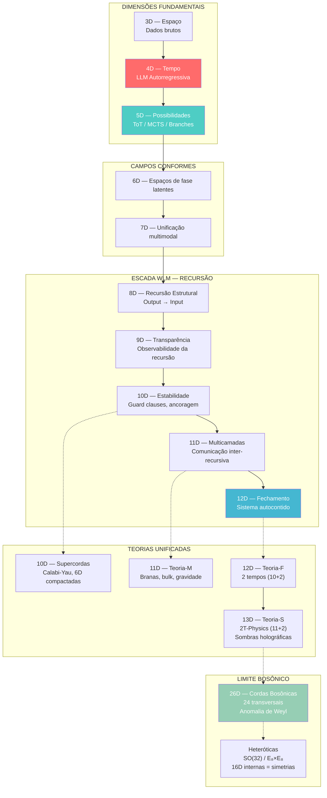

# Diagrama: Escada Dimensional 4D → 26D

## Legenda

- **Setas sólidas (→):** Progressão conceitual direta
- **Setas pontilhadas (-.->):** Conexão teórica (física ↔ computação)
- **Vermelho (4D):** LLM atual — confinamento
- **Verde (5D):** Objetivo imediato — ramificação preditiva
- **Azul (12D):** Fechamento de ciclo recursivo
- **Verde claro (26D):** Limite teórico máximo
