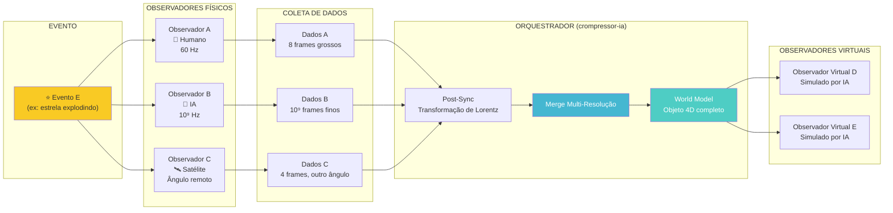

# Diagrama: Fluxo de Observadores Orquestrados

## Explicação

1. **Evento E** ocorre no espaço-tempo
2. **Observadores físicos** (A, B, C) capturam com resoluções e ângulos diferentes
3. **Post-Sync** alinha temporalmente via transformações relativísticas
4. **Merge** combina dados em Realidade Multi-Resolução
5. **World Model** reconstrói o evento como objeto 4D completo
6. **Observadores Virtuais** são gerados pela IA para perspectivas não capturadas

> O observador B preenche os frames que A perdeu. O observador C adiciona ângulo que nenhum dos dois tinha. Os virtuais (D, E) cobrem pontos que ninguém fisicamente alcançou.
