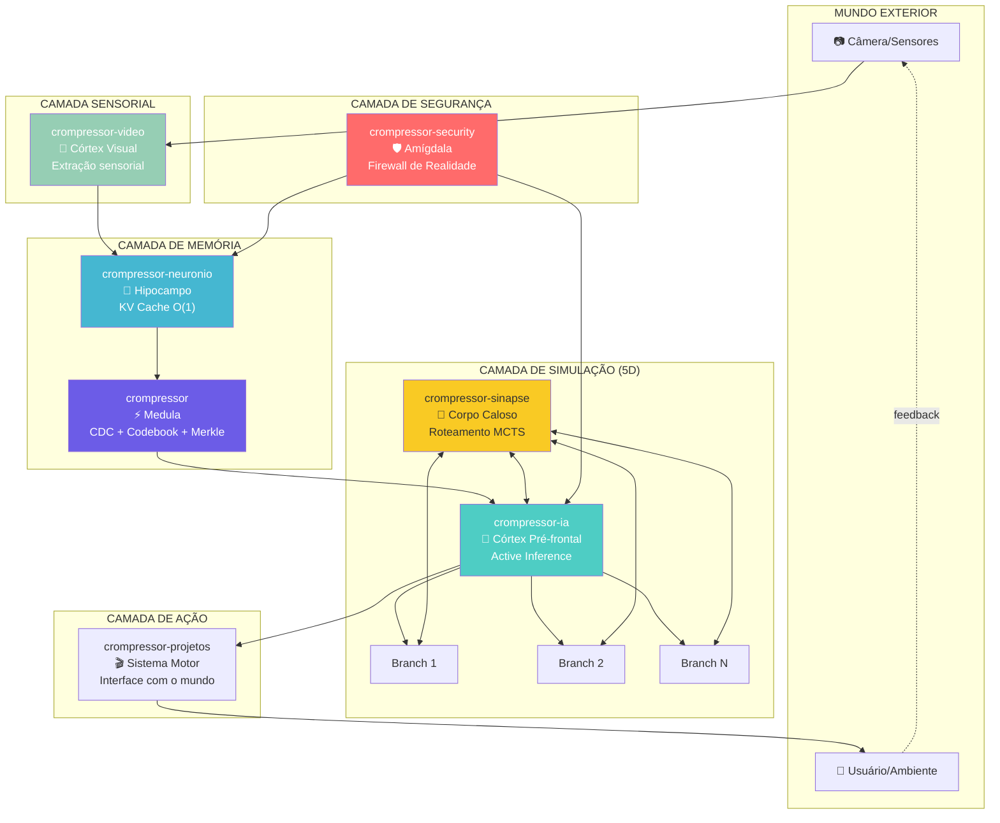

# Diagrama: Ecossistema Crompressor como Motor 5D

## Fluxo de Dados

1. **Sensores** capturam o ambiente → **video** extrai modelo geométrico
2. **neurônio** comprime em Codebook ID + Delta → armazena O(1)
3. **ia** gera branches de simulação (ToT/MCTS)
4. **sinapse** roteia comunicação entre branches
5. **security** filtra alucinações antes de contaminar memória
6. **ia** colapsa na branch ótima → **projetos** executa no mundo real
