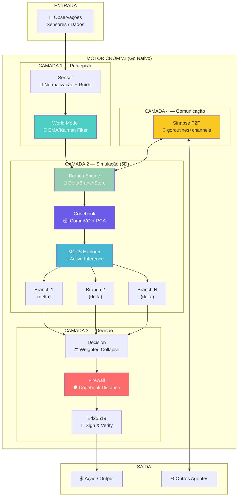

# Diagrama: Motor CROM v2 — Arquitetura Completa

## Fluxo

1. **Observação** entra no sensor → normalizada
2. **World Model** atualiza predição interna
3. **Branch Engine** gera N futuros possíveis (deltas XOR)
4. **Codebook** comprime cada branch (CommVQ, RoPE-comutativo)
5. **MCTS** explora a árvore com Active Inference (minimiza free energy)
6. **Decision** colapsa na branch ótima (weighted por variância)
7. **Firewall** verifica distância ao codebook (alucinação?)
8. **Ed25519** assina o output (soberania)
9. **Sinapse** distribui deltas para outros agentes via P2P
