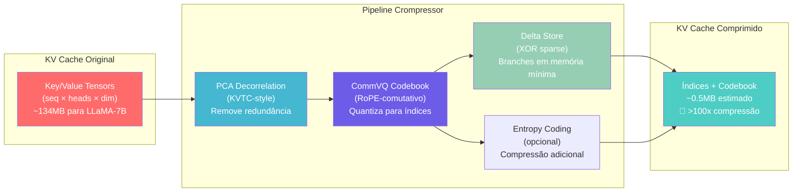

# Diagrama: Pipeline de Compressão KV Cache v2

## Comparação com SOTA

| Etapa | Paper de Referência | Resultado Isolado | Combinado (estimativa) |
|-------|--------------------|--------------------|----------------------|
| PCA decorrelation | KVTC (ICLR 2026) | 20-40x | — |
| CommVQ (RoPE) | CommVQ (Apple 2025) | 16-32x | — |
| Delta branches | **Crompressor (nós)** | 99.9% economia | — |
| **Pipeline completo** | **Ninguém** | — | **>100x** |
