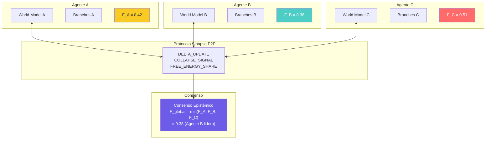

# Diagrama: Rede Multi-Agente CROM

## Protocolo

1. Cada agente calcula sua **free energy F** local
2. Via Sinapse P2P, agentes compartilham F + deltas
3. O agente com **menor F** (melhor modelo do mundo) lidera
4. Outros agentes recebem delta updates para convergir
5. **Consenso epistêmico** emerge sem servidor central
